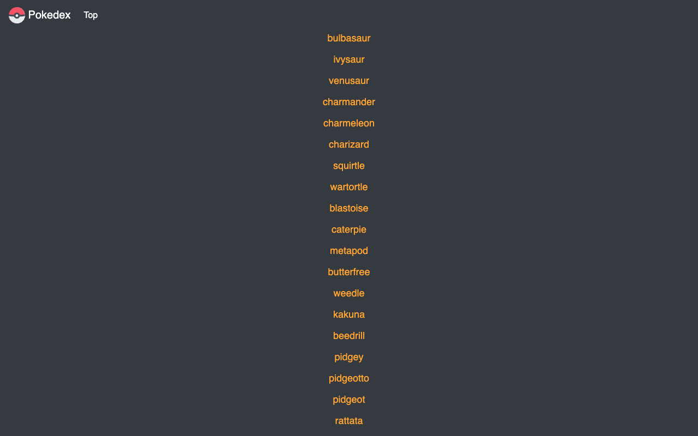

Pokedex app

About 
This app uses the HTML, CSS, Bootstrap and Javascript including jQuery throughout to showcase the different tools and ideas i've learned during this achievement. 
Pokemon characters are displayed from an external API and listed using buttons where you can click on each one and a modal will show the selected Pokemon's name, height and picture.

Dependencies 
HTML, CSS, Bootstrap, Pokemon API, Javascript, jQuery

